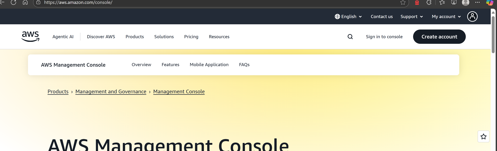
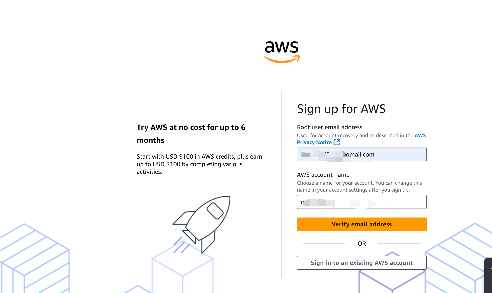
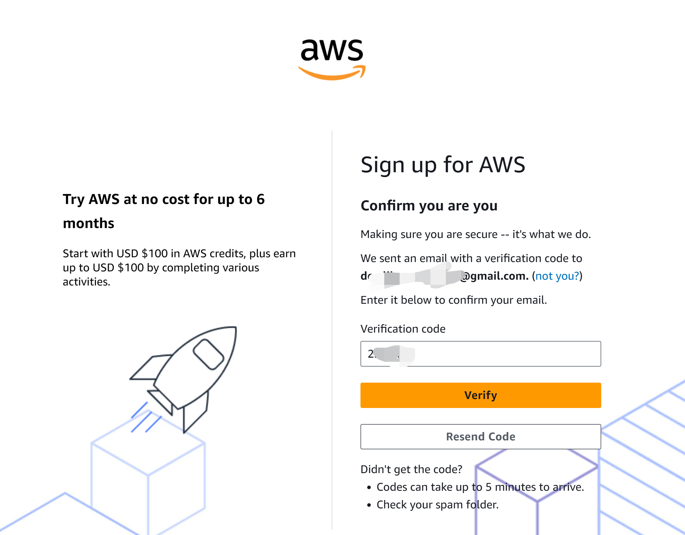
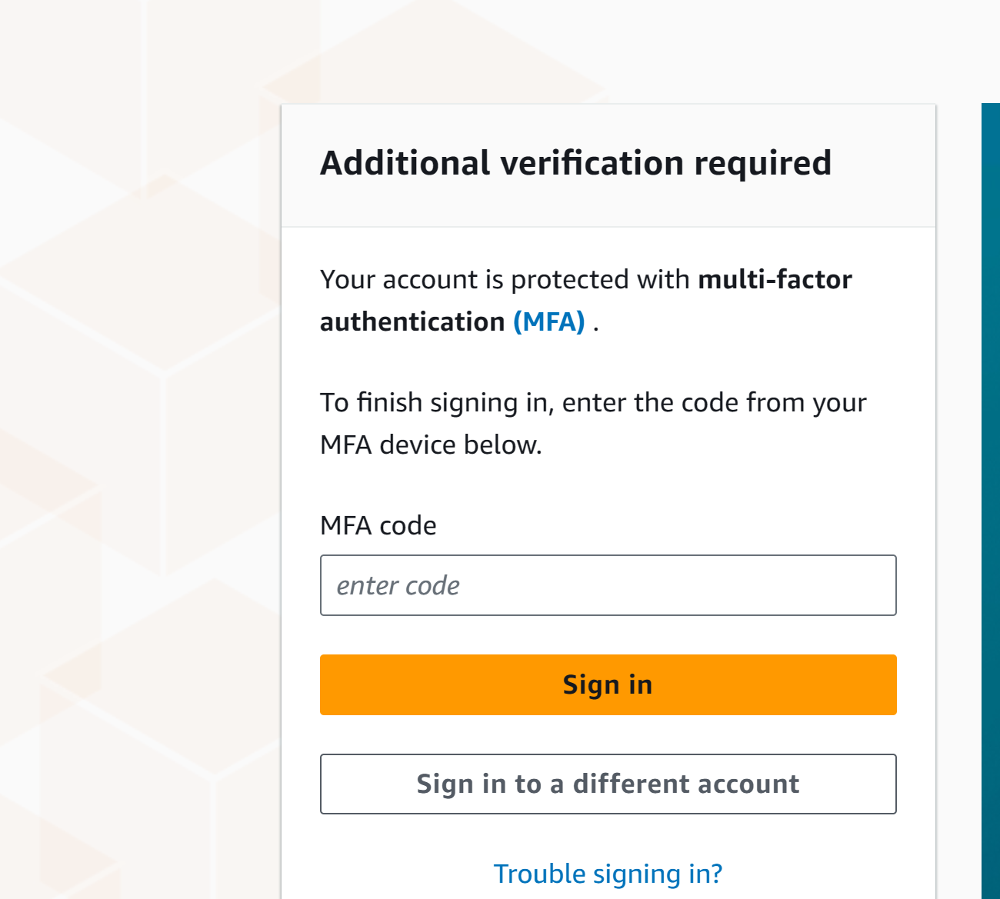
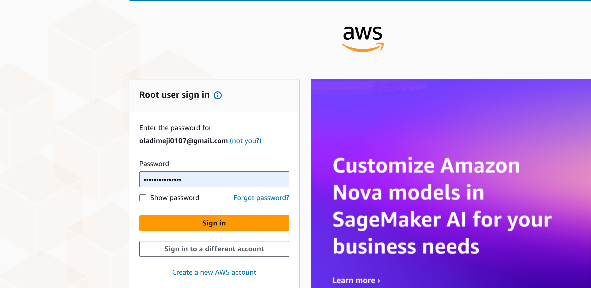

# AWS Free Tier Account Creation Guide

This guide provides step-by-step instructions on how to create a free tier account on Amazon Web Services (AWS). The AWS Free Tier allows new users to explore and use AWS services free of charge within certain usage limits.

---

## Table of Contents

- [Prerequisites](#prerequisites)  
- [Step 1: Navigate to AWS Registration](#step-1-navigate-to-aws-registration)  
- [Step 2: Enter Account Details](#step-2-enter-account-details)  
- [Step 3: Payment Information](#step-3-payment-information)  
- [Step 4: Identity Verification](#step-4-identity-verification)  
- [Step 5: Select Free Tier Plan](#step-5-select-free-tier-plan)  
- [Step 6: Complete Setup](#step-6-complete-setup)  
- [Important Notes](#important-notes)  
- [Helpful Links](#helpful-links)  

---

## Prerequisites

- An active email address  
- A valid phone number for verification  
- A valid credit card or debit card (no charges apply for free tier usage, but a temporary authorization charge may be applied for verification.)  
- Basic understanding of AWS services (optional but helpful)  

---

## Step 1: Navigate to AWS Registration

Go to the official AWS website at [https://aws.amazon.com/](https://aws.amazon.com/).  
Click on "Create an AWS Account" in the top right corner.

---

## Step 2: Enter Account Details

- Provide your email address.  
- Enter a strong password.  
- Choose an AWS account name (this can be your personal or business name).  
- Click "Continue".
 
---

## Step 3: Payment Information

- Enter your credit or debit card details for verification purposes.  
- Note: Your card will not be charged as long as you stay within the free tier limits.  
- A temporary authorization charge may appear and will be refunded.
 
---

## Step 4: Identity Verification

- Enter your phone number for verification.  
- Choose whether you prefer SMS or voice call for receiving the verification code.  
- Enter the received verification code to confirm your identity.

---

## Step 5: Select Free Tier Plan

- Choose the "Basic Support Plan" (free).  
- This plan includes 24/7 access to customer service, AWS forums, and limited support.

---

## Step 6: Complete Setup

- Review AWS Customer Agreement and accept the terms.  
- Click "Complete Sign Up" to finish the registration process.  
- You will receive a confirmation email once your account is ready.

---

## Important Notes

- The AWS Free Tier is valid for 12 months from the date you create your account.  
- Free Tier usage limits apply; exceeding these may incur charges.  
- Monitor your usage regularly to avoid unexpected fees.  
- Set up billing alerts in the AWS Management Console for safety.  
- You can start using AWS services immediately after account activation.

---
## Logging Into Your AWS Free Tier Account

Once your AWS Free Tier account is created and activated, you can log in to start using AWS services. Follow these steps to log in:

---

### Step 1: Navigate to AWS Management Console

- Go to the AWS homepage at [https://aws.amazon.com/](https://aws.amazon.com/).  
- Click on the **"Sign In to the Console"** button located at the top right corner.

---

### Step 2: Enter Your Credentials

- Select **"Root user"** (default option) on the sign-in page.  
- Enter the email address you used to create your AWS account.  
- Click **"Next"**.

---

### Step 3: Enter Your Password

- Enter the password you set during account creation.  
- Click **"Sign In"**.

---

### Step 4: Access the AWS Management Console

- After successful login, you will be directed to the AWS Management Console dashboard.  
- From here, you can browse and use various AWS services as part of your Free Tier plan.

---

For more details and help, visit the [AWS Sign-In FAQs](https://aws.amazon.com/premiumsupport/knowledge-center/sign-in-issues/).

---

## Helpful Links

- [AWS Free Tier Details](https://aws.amazon.com/free/)  
- [AWS Pricing Calculator](https://calculator.aws/#/)  
- [AWS Support Center](https://aws.amazon.com/support)  

---

Thank you for choosing AWS Free Tier! For any issues or further assistance, refer to AWS Support or AWS Community Forums.
